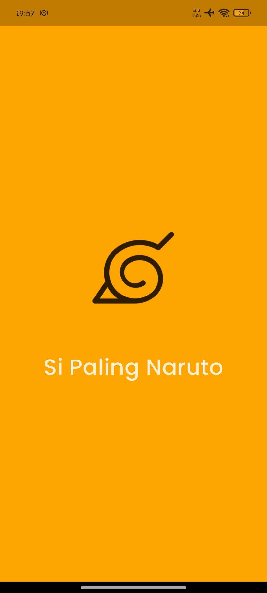
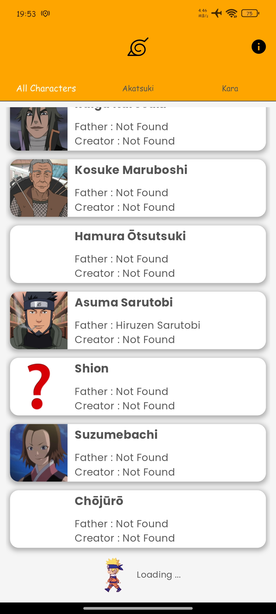
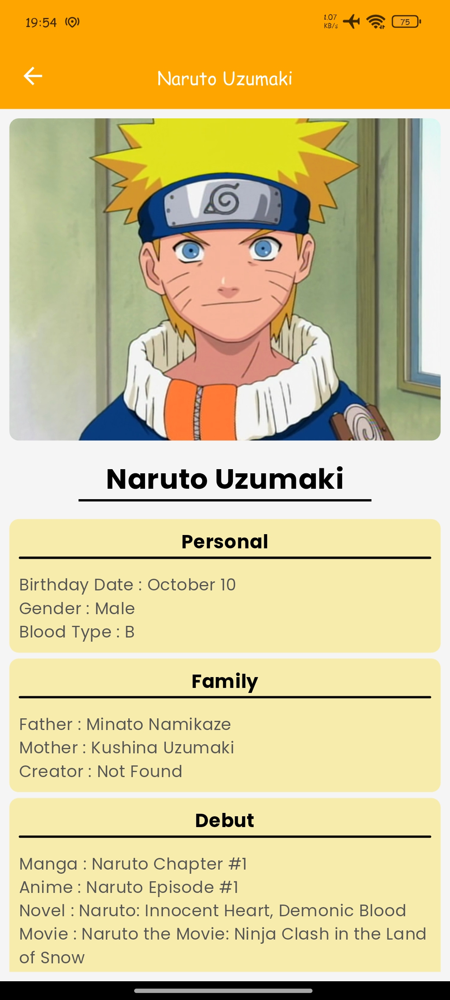

# SiPalingNaruto Project

Ini merupakan project Teknologi Mobile Praktikum Informatika 2024/2025 kelas IF-B dengan developer : [Diandra Yusuf A. (123220031)](https://github.com/haloYusuf)

# Penjelasan Aplikasi

  

Aplikasi ini menggunakan API public [Naruto](https://api-dattebayo.vercel.app/docs) dengan tujuan menerapkan cara untuk melakukan komunikasi dengan API dengan fitur :

- Characters
- Akatsuki
- Kara
- Detail tiap karakter

Untuk mencoba aplikasi bisa akses [di sini.](https://drive.google.com/file/d/1Y4HWCVFcEEdRusrANtoOrpf65rhaqdpH/view?usp=sharing)

# Tampilan Aplikasi

  
  
  

